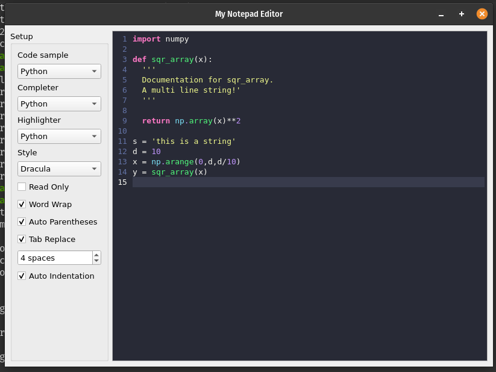

# MyNotepadEditor

# Project Report: Notepad/Code Editor in Qt5

## 1. Project Overview

### 1.1 Introduction

The goal of this project was to create a Notepad/Code Editor application using object-oriented programming (OOP) principles, implemented with the Qt5 framework that is both versatile, fast, and portable easily. The application serves as a simple yet powerful text editor with features suited for both general text editing and coding, such as syntax highlighting, multi-tab support, and file handling.

### 1.2 Features

- **Multi-tab support**: Allows users to open and edit multiple documents simultaneously in different tabs.
- **Syntax highlighting**: Implements syntax highlighting for various programming languages (e.g., Python, C++, JavaScript, GLSL).
- **File management**: Supports common file operations, including open, save, save as, and file encoding handling.
- **Undo/Redo**: Provides undo and redo functionality for editing.
- **Search and Replace**: Implements search functionality with optional replace.
- **Customizable UI**: Offers basic theme adjustments, font size, and color preferences.

---

## 2. Technologies Used

### 2.1 Qt5 Framework

The project was built using the Qt5 framework, which is well-suited for developing cross-platform applications. The Qt Widgets module was used to design the user interface (UI), while the QtCore module provided essential features like file handling, event management, and text manipulation.

### 2.2 Programming Languages

- **C++**: The primary programming language for implementing the application logic.
- **QML (Optional)**: Used for UI customization.

### 2.3 IDE & Tools

- **Qt Creator**: Integrated Development Environment (IDE) used for writing and compiling the project.
- **CMake**: Used for project building and configuration.
- **Git**: For version control.

---

## 3. Object-Oriented Design

### 3.1 Classes and Inheritance

The core of the application is built around several key classes that follow OOP principles. Here’s a breakdown of the main classes and their responsibilities:

#### 3.1.1 MainWindow Class
- The primary window of the application that manages the overall UI, including the toolbar, status bar, and menus.
- Handles events like opening, saving, and closing files.
- Uses `QTextEdit` for text input and display.

#### 3.1.2 QCXXHighlighter Class
- Handles syntax highlighting for C++.
- Highlights keywords, data types, comments, and other syntax elements specific to C++.

#### 3.1.3 QCodeEditor Class
- Serves as the central editor widget that integrates syntax highlighting, code completion, and other features like line numbers and text formatting.
- Inherits from `QTextEdit` and interacts with language-specific highlighters and completers.

#### 3.1.4 QFramedTextAttribute Class
- Provides a framework for defining text attributes that can be applied to code, such as bold, italics, and color.

#### 3.1.5 QGLSLCompleter Class
- Implements code completion for GLSL (OpenGL Shading Language).
- Suggests keywords, functions, and variables as the user types, enhancing the GLSL coding experience.

#### 3.1.6 QGLSLHighlighter Class
- Provides syntax highlighting for GLSL code, highlighting shaders, built-in functions, and other GLSL-specific constructs.

#### 3.1.7 QJSONHighlighter Class
- Implements syntax highlighting for JSON (JavaScript Object Notation) files, making it easier to read and understand JSON data.

#### 3.1.8 QLanguage Class
- Manages language-specific attributes like keywords, operators, and syntax rules.
- Acts as a base for language-specific highlighters and completers.

#### 3.1.9 QLineNumberArea Class
- Implements a side panel that displays line numbers next to the code editor.
- Synchronizes with the text editor, ensuring the line numbers remain accurate as the user scrolls or edits the text.

#### 3.1.10 QLuaCompleter Class
- Provides code completion for Lua code.
- Suggests Lua keywords, functions, and variables.

#### 3.1.11 QLuaHighlighter Class
- Highlights Lua syntax, including keywords, comments, and string literals, to make the code easier to read.

#### 3.1.12 QPythonCompleter Class
- Implements Python-specific code completion.
- Suggests Python keywords, functions, and standard libraries as the user types.

#### 3.1.13 QPythonHighlighter Class
- Provides syntax highlighting for Python code, focusing on elements like indentation, function definitions, and keywords.

#### 3.1.14 QStyleSyntaxHighlighter Class
- A base class providing common functionality for all syntax highlighters.
- Ensures consistency in style and formatting across different language-specific highlighters.

#### 3.1.15 QSyntaxStyle Class
- Defines styles used for syntax highlighting, including colors, fonts, and text attributes for different code elements.

#### 3.1.16 QXMLHighlighter Class
- Implements syntax highlighting for XML files, ensuring that elements, attributes, and values are clearly distinguished.

#### 3.1.17 QCodeEditor Class
- Defines the overall UI layout and the location of widgets placed in the window.

---

## 4. Key Features Implementation

With the addition of these new classes, the editor now supports advanced features like multi-language syntax highlighting, code completion, and enhanced UI elements. Here’s how the features are implemented:

### 4.1 Multi-Language Support

The editor supports syntax highlighting and code completion for various programming languages, including:
- **C++**: `QCXXHighlighter` for syntax highlighting and `QCodeEditor` for code editing.
- **GLSL**: `QGLSLHighlighter` and `QGLSLCompleter` for shader programming.
- **Python**: `QPythonHighlighter` and `QPythonCompleter` for Python code.
- **Lua**: `QLuaHighlighter` and `QLuaCompleter` for Lua scripts.
- **JSON**: `QJSONHighlighter` for highlighting JSON data.
- **XML**: `QXMLHighlighter` for XML files.

### 4.2 Code Completion

Auto-completion is supported for all major programming languages. The relevant completer classes, such as `QGLSLCompleter`, `QLuaCompleter`, and `QPythonCompleter`, offer suggestions for keywords, functions, variables, and more, as the user types.

### 4.3 Line Numbers

The `QLineNumberArea` class adds a line number display alongside the text editor. It updates dynamically as the user scrolls or edits the document, ensuring accurate line numbering at all times.

### 4.4 Syntax Highlighting

Each language-specific highlighter class, such as `QPythonHighlighter` or `QLuaHighlighter`, is responsible for highlighting code elements in different colors, making the code more readable and helping developers spot errors more easily.

### 4.5 File Management

The `FileManager` class handles file operations, such as loading and saving files. The editor dynamically adjusts to the file type, activating the appropriate syntax highlighter and code completion features based on the file’s language.

---

## 5. Design Considerations

### 5.1 User Interface Design

The user interface is designed for simplicity and ease of use. It includes a standard menu bar with options for common text-editing operations and a toolbar with quick-access buttons for frequently used features like opening, saving, and printing files.

### 5.2 Error Handling

Error handling is implemented to manage potential issues like file not found, permission errors, or unsupported file formats. Appropriate messages are displayed to the user in case of errors.

### 5.3 Code Reusability and Modularity

By following OOP principles, the code is modular and reusable. Each class has a single responsibility, making it easy to extend the application with new features, such as adding support for more programming languages or implementing additional plugins.

---

## 6. Testing

### 6.1 Unit Testing

Unit tests were written for critical components like file handling, text manipulation, and syntax highlighting. The Qt test framework was used to automate the tests.

### 6.2 Manual Testing

Manual testing focused on the following:
- Verifying syntax highlighting and code completion

---

## 7. Screenshots

### 7.1 Screenshot 1: Main Application Window

### 7.2 Screenshot 2: Syntax Highlighting in Action

### 7.3 Screenshot 3: Code Completion in Action

### 7.4 Screenshot 4: Customization Sidebar

### 7.5 Screenshot 5: Integrated ChatGPT Window for Chatting

### 7.6 Screenshot 6: Read and Write to a File on Disk

---

## 8. Conclusion

This project successfully implements a functional Notepad/Code Editor with advanced features like syntax highlighting, multi-language support, code completion, and a customizable UI. The use of object-oriented principles ensures that the application is modular, extensible, and maintainable. Future improvements could include adding additional languages, themes, and plugin support.

